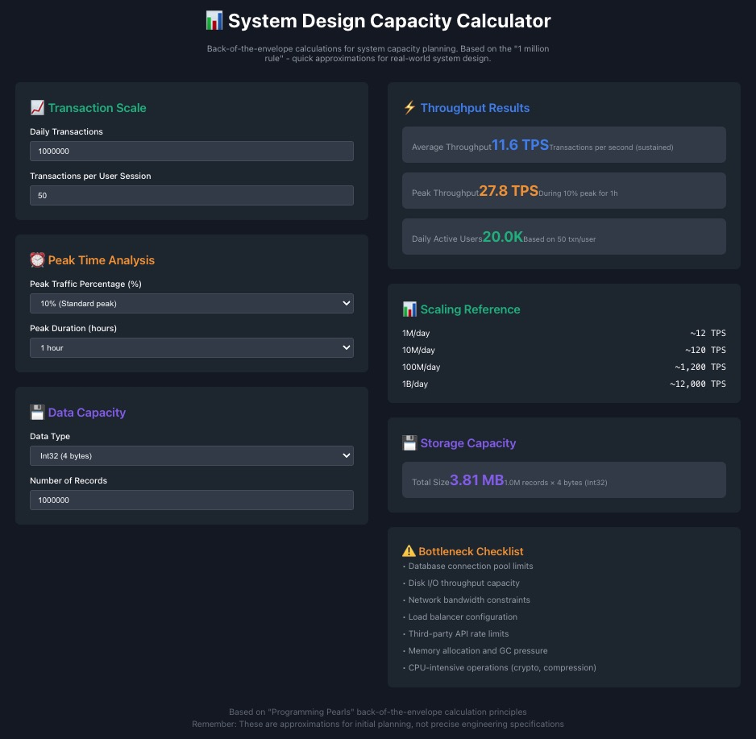

# 📊 System Design Capacity Calculator

*Read this in other languages: [한국어](#한국어) | [中文](#中文)*

---

## English

### 🎯 Overview

A web-based capacity calculator for system design that implements back-of-the-envelope calculations based on the **"1 million rule"**. This tool helps software architects and engineers quickly estimate system throughput, peak loads, and storage requirements during the initial phases of system design.

**🔗 Inspired by:** [How I Calculate Capacity for Systems Design](https://dev.to/ievolved/how-i-calculate-capacity-for-systems-design-3477) - A practical approach to capacity planning from "Programming Pearls" principles.

### ✨ Key Features

- **Real-time Calculations**: Instant capacity estimations as you adjust parameters
- **Peak Load Analysis**: Calculate traffic spikes with configurable peak percentages and durations  
- **Data Storage Planning**: Estimate storage requirements for different data types
- **Scaling Reference**: Quick lookup table for common traffic scales (1M → 1B+ transactions/day)
- **Bottleneck Identification**: Built-in checklist of common system bottlenecks
- **Responsive Design**: Works seamlessly on desktop and mobile devices

### 🛠 Tech Stack

- **Frontend**: React 18+ with TypeScript
- **Architecture**: Atomic Design Pattern
- **Styling**: CSS-in-JS with responsive design
- **State Management**: Custom React Hooks
- **Build Tool**: Create React App
- **Code Quality**: ESLint + TypeScript strict mode

### 🚀 Quick Start

```bash
# Clone the repository
git clone https://github.com/yourusername/system-design-capacity-calculator.git
cd system-design-capacity-calculator

# Install dependencies
npm install

# Start development server
npm start

# Build for production
npm run build
```

Open [http://localhost:3000](http://localhost:3000) to view it in your browser.

### 📋 Usage

1. **Input Daily Transactions**: Enter expected daily transaction volume
2. **Configure User Behavior**: Set average transactions per user session
3. **Define Peak Patterns**: Specify peak traffic percentage and duration
4. **Select Data Types**: Choose data types for storage calculations
5. **Review Results**: Analyze throughput, capacity, and bottleneck recommendations

### 🏗 Project Structure

```
src/
├── components/
│   ├── atoms/          # Basic UI elements (Input, Select, Label, Text)
│   ├── molecules/      # Component combinations (InputField, MetricCard)
│   ├── organisms/      # Business logic sections (7 main sections)
│   ├── templates/      # Layout structure (CalculatorTemplate)
│   └── pages/          # Final pages (CapacityCalculatorPage)
├── hooks/              # Custom hooks (useCalculator)
├── types/              # TypeScript type definitions
├── utils/              # Utility functions
└── constants/          # Constant definitions
```

### 🤝 Contributing

1. Fork the project
2. Create your feature branch (`git checkout -b feature/AmazingFeature`)
3. Commit your changes (`git commit -m 'Add some AmazingFeature'`)
4. Push to the branch (`git push origin feature/AmazingFeature`)
5. Open a Pull Request

---

## 한국어

### 🎯 개요

시스템 설계 시 **"1 million 규칙"**을 기반으로 한 백 오브 더 엔벨로프 계산을 구현한 웹 기반 용량 계산기입니다. 소프트웨어 아키텍트와 엔지니어가 시스템 설계 초기 단계에서 시스템 처리량, 피크 부하, 스토리지 요구사항을 빠르게 추정할 수 있도록 도와줍니다.

**🔗 참고 자료:** [How I Calculate Capacity for Systems Design](https://dev.to/ievolved/how-i-calculate-capacity-for-systems-design-3477) - "Programming Pearls" 원칙을 바탕으로 한 실용적인 용량 계획 접근법

### ✨ 주요 기능

- **실시간 계산**: 매개변수 조정 시 즉시 용량 추정
- **피크 부하 분석**: 구성 가능한 피크 비율 및 지속 시간으로 트래픽 급증 계산
- **데이터 스토리지 계획**: 다양한 데이터 타입에 대한 스토리지 요구사항 추정
- **스케일링 참조**: 일반적인 트래픽 규모에 대한 빠른 참조표 (1M → 1B+ 트랜잭션/일)
- **병목지점 식별**: 일반적인 시스템 병목지점 내장 체크리스트
- **반응형 디자인**: 데스크톱 및 모바일 기기에서 완벽 작동

### 🛠 기술 스택

- **프론트엔드**: React 18+ with TypeScript
- **아키텍처**: Atomic Design Pattern
- **스타일링**: CSS-in-JS with 반응형 디자인
- **상태 관리**: Custom React Hooks
- **빌드 도구**: Create React App
- **코드 품질**: ESLint + TypeScript strict mode

### 🚀 빠른 시작

```bash
# 저장소 복제
git clone https://github.com/yourusername/system-design-capacity-calculator.git
cd system-design-capacity-calculator

# 의존성 설치
npm install

# 개발 서버 시작
npm start

# 프로덕션 빌드
npm run build
```

브라우저에서 [http://localhost:3000](http://localhost:3000)을 열어 확인하세요.

### 📋 사용법

1. **일일 트랜잭션 입력**: 예상 일일 트랜잭션 볼륨 입력
2. **사용자 행동 구성**: 사용자 세션당 평균 트랜잭션 설정
3. **피크 패턴 정의**: 피크 트래픽 비율 및 지속 시간 지정
4. **데이터 타입 선택**: 스토리지 계산을 위한 데이터 타입 선택
5. **결과 검토**: 처리량, 용량, 병목지점 권장사항 분석

---

## 中文

### 🎯 概述

基于**"1 million 规则"**实现信封背面计算的系统设计容量计算器。帮助软件架构师和工程师在系统设计初期快速估算系统吞吐量、峰值负载和存储需求。

**🔗 参考资料:** [How I Calculate Capacity for Systems Design](https://dev.to/ievolved/how-i-calculate-capacity-for-systems-design-3477) - 基于"Programming Pearls"原则的实用容量规划方法

### ✨ 主要功能

- **实时计算**: 调整参数时即时容量估算
- **峰值负载分析**: 使用可配置的峰值百分比和持续时间计算流量激增
- **数据存储规划**: 估算不同数据类型的存储需求
- **扩展参考**: 常见流量规模快速查找表 (1M → 1B+ 事务/天)
- **瓶颈识别**: 内置常见系统瓶颈检查清单
- **响应式设计**: 在桌面和移动设备上完美运行

### 🛠 技术栈

- **前端**: React 18+ with TypeScript
- **架构**: Atomic Design Pattern
- **样式**: CSS-in-JS with 响应式设计
- **状态管理**: Custom React Hooks
- **构建工具**: Create React App
- **代码质量**: ESLint + TypeScript strict mode

### 🚀 快速开始

```bash
# 克隆仓库
git clone https://github.com/yourusername/system-design-capacity-calculator.git
cd system-design-capacity-calculator

# 安装依赖
npm install

# 启动开发服务器
npm start

# 生产构建
npm run build
```

在浏览器中打开 [http://localhost:3000](http://localhost:3000) 查看。

### 📋 使用方法

1. **输入日事务量**: 输入预期的日事务量
2. **配置用户行为**: 设置每个用户会话的平均事务数
3. **定义峰值模式**: 指定峰值流量百分比和持续时间
4. **选择数据类型**: 为存储计算选择数据类型
5. **查看结果**: 分析吞吐量、容量和瓶颈建议

---

## 📸 Screenshots



---

## 🔄 Recent Updates

- **v1.0.0** - Initial release with full Atomic Design implementation
- **Enhanced UX** - Improved responsive design and real-time calculations
- **Type Safety** - Complete TypeScript coverage
- **Modular Architecture** - Atomic Design Pattern for scalability

---

## 🌟 Acknowledgments

- Inspired by [Programming Pearls](https://www.amazon.com/Programming-Pearls-2nd-Jon-Bentley/dp/0201657880) by Jon Bentley
- Original blog post by [ievolved](https://dev.to/ievolved) on capacity calculation methodology
- React community for excellent development tools and patterns


